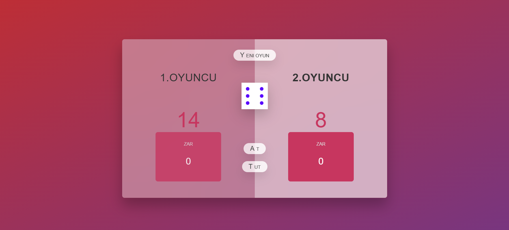
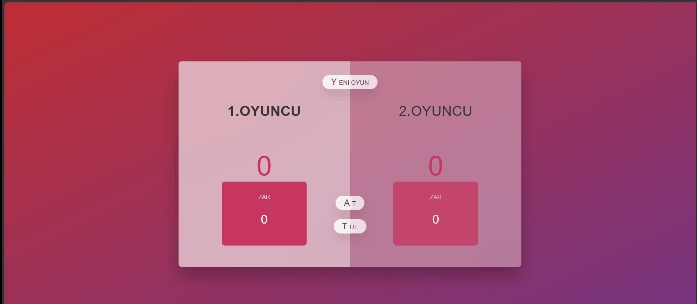

<h1 align="center">🎲 Pig Game (Dice Game)</h1>

JavaScript kullanılarak geliştirilmiş, iki oyunculu interaktif ve strateji tabanlı 
bir <strong>Dice Game (Pig Game)</strong> uygulamasıdır.
Oyuncular zar atarak puan toplar ve belirlenen skora ulaşmaya çalışır.

<h2>📌 Proje Amacı</h2>

Bu proje, JavaScript ile DOM manipülasyonu, event handling ve oyun mantığı
(state management) geliştirme konularını pratik etmek amacıyla hazırlanmıştır.

<ul>
<li>🎮 İki oyunculu oyun mekaniği</li>
<li>🎲 Rastgele zar üretimi</li>
<li>📊 Skor ve aktif oyuncu yönetimi</li>
<li>⚡ DOM manipülasyonu</li>
<li>🔁 Oyun akışı kontrolü (turn-based logic)</li>
<li>🎨 Dinamik arayüz güncellemeleri</li>
</ul>

<h2>🛠 Kullanılan Teknolojiler</h2>

<ul>
<li>HTML5 (Semantic Structure)</li>
<li>CSS3 (Modern UI & Glassmorphism)</li>
<li>JavaScript (ES6)</li>
<li>DOM Manipulation</li>
<li>Event Listeners</li>
</ul>

<h2>✨ Öne Çıkan Özellikler</h2>

<ul>
<li>Zar atma mekaniği (Random Dice Roll)</li>
<li>Aktif oyuncu değişimi</li>
<li>1 geldiğinde turun sıfırlanması</li>
<li>“Hold” ile skoru sabitleme</li>
<li>Kazanan oyuncunun belirlenmesi</li>
<li>Oyun sıfırlama (New Game)</li>
<li>Dinamik UI değişiklikleri (active / winner state)</li>
</ul>

<h2>📂 Proje Yapısı</h2>

<pre>
pig-game-javascript/
│
├── index.html
├── style.css
├── script.js
├── dice-1.png
├── dice-2.png
├── dice-3.png
├── dice-4.png
├── dice-5.png
├── dice-6.png
├── image.png
└── image.gif
</pre>

<h2>📸 Proje Önizleme</h2>

<h3>Arayüz</h3>

<h3>Oyun Demo</h3>

<h2>🚀 Kurulum</h2>

Projeyi klonlayın:

<pre>
git clone https://github.com/kenansonmez1617-hub/pig-game-javascript.git
</pre>

Ardından <strong>index.html</strong> dosyasını tarayıcıda açmanız yeterlidir.

<h2>👨‍💻 Geliştirici</h2>

<strong>Kenan Sönmez</strong> 
Frontend Developer

GitHub: 
<a href="https://github.com/kenansonmez1617-hub" target="_blank">
https://github.com/kenansonmez1617-hub
</a>

LinkedIn: 
<a href="https://www.linkedin.com/in/kenan-sonmez" target="_blank">
https://www.linkedin.com/in/kenan-sonmez
</a>

<h2>📄 Lisans</h2>

Bu proje eğitim ve portfolyo amaçlı geliştirilmiştir.
İncelenebilir ve geliştirilebilir.

⭐ Beğendiyseniz projeye yıldız bırakabilirsiniz.

